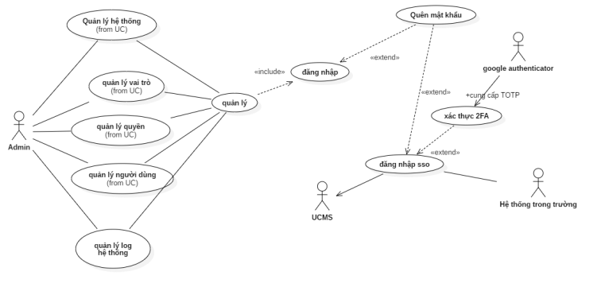
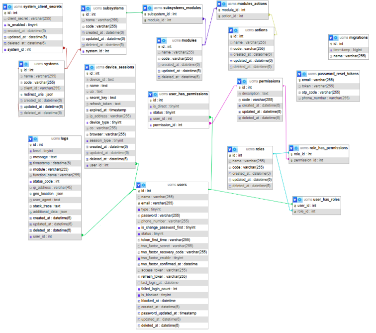
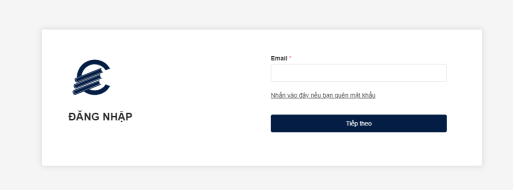
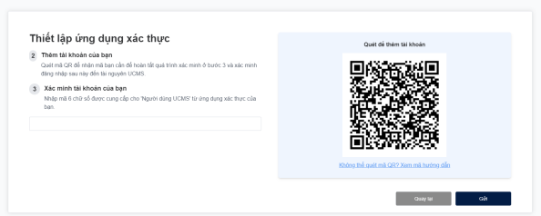
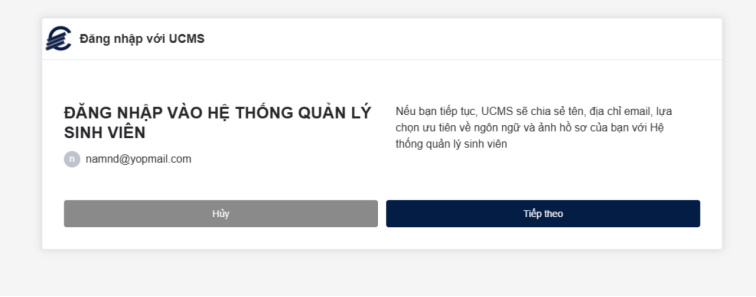
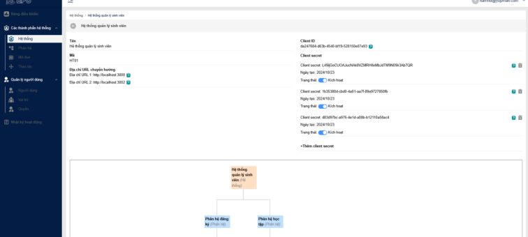
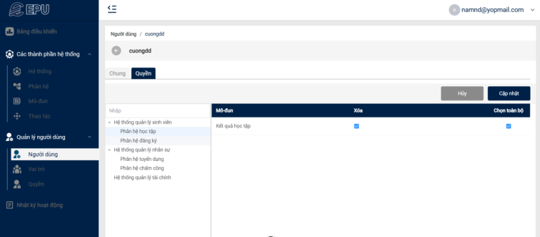

# Project Overview:

Educational institutions, especially universities, face significant challenges in user management due to the rapid growth of technology and increasing numbers of students and faculty. Managing and securing user information is crucial, yet many universities still rely on manual methods or disconnected systems, leading to:

- Data fragmentation: User data is spread across multiple systems (student management, library, e-learning), making data consolidation difficult and prone to inconsistencies.
- Lack of transparency: Disjointed systems make access control complex, increasing the risk of unauthorized access and misuse.
  Security vulnerabilities: Inconsistent security measures across systems create potential risks of cyberattacks and data breaches.
- Inefficient management: Manual processes and non-integrated systems slow down user-related tasks, impacting both administrators and end users.

The User Central Management System (UCMS) addresses these challenges by providing a centralized, secure, and efficient platform for managing user accounts and access across various university services.

# Purpose and Objectives:

Facing challenges in user management, the Centralized User Management System is designed to achieve the following key objectives:

- Integrate and centralize user data: Aggregate user data from various sources (e.g., student management system, library) into a single platform, ensuring easy, fast, and consistent data access.
- Clear access control management: Define specific permissions for different user groups (students, faculty, administrators), ensuring only authorized users can access relevant resources.
- Enhance data security: Implement robust security measures to protect user data from internal and external threats, including data encryption, two-factor authentication (2FA), and login monitoring.
- Improve transparency in management: Record and store all access activities, data modifications, and permission changes, providing tools for monitoring and auditing.
- Optimize management efficiency: Minimize time and effort in handling user-related requests such as granting permissions, account recovery, and information retrieval.

# Tech Stack:

- Frontend: VueJS and Tailwind CSS - Ensuring a fast, and user-friendly interface
- Backend: NestJS - A progressive Node.js framework for building efficient, reliable, and scalable server-side applications
- Database: MySQL - A popular open-source relational database management system
- Documentation: Swagger - A tool for designing, building, and documenting APIs

# Key Features:

- SSO (Single Sign-On) Integration: Enables seamless login for other university systems through the Centralized User Management System (UCMS), acting as a unified authentication platform.
- User Access Control: Allows precise permission management, granting users access to specific systems based on their roles and responsibilities.
- System Management: Supports the creation and administration of systems integrated with UCMS, ensuring efficient and centralized control.

# UC diagram


| No. | Actor | Description |
|----|--------------------------------------|-------------------------------------------------------------------------|
| 1 | Admin | Manages the entire system. |
| 2 | Internal University Systems | Integrates SSO login with the Centralized User Management System (UCMS). |
| 3 | Centralized User Management System (UCMS) | Acts as an SSO, providing authentication and identity management for university systems. |
| 4 | Google Authenticator | Used for two-factor authentication (2FA) to enhance account security. |

# Database Schema



# Figma Design:

- [View the design in this link](https://www.figma.com/design/EHUjD7IoHvS8UX3hJZw5Rh/H%E1%BB%87-th%E1%BB%91ng-qu%E1%BA%A3n-l%C3%BD-ng%C6%B0%E1%BB%9Di-d%C3%B9ng-t%E1%BA%ADp-trung?node-id=0-1&t=UpaStzWyPkSNrqGh-1)

# Photo/Video Demo:

- [Watch the video demo in this link](https://youtu.be/RZugcrbZJOc)

- Some screenshots of the application:
  
  
  
  
  

## Recommended IDE Setup

[VSCode](https://code.visualstudio.com/) + [Volar](https://marketplace.visualstudio.com/items?itemName=Vue.volar) (and disable Vetur).

## Customize configuration

See [Vite Configuration Reference](https://vitejs.dev/config/).

## Project Setup

```sh
npm install
```

### Compile and Hot-Reload for Development

```sh
npm run dev
```

### Compile and Minify for Production

```sh
npm run build
```

### Run Unit Tests with [Vitest](https://vitest.dev/)

```sh
npm run test:unit
```

### Lint with [ESLint](https://eslint.org/)

```sh
npm run lint
```
